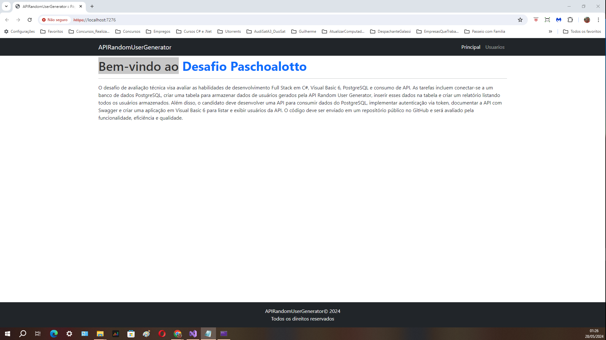

# C#, Visual Basic 6, PostgreSQL e consumo de API
 
## DESAFIO
Este desafio técnico visa avaliar as habilidades de desenvolvimento Full Stack em C#, Visual Basic 6, PostgreSQL e consumo de API. As tarefas incluem conectar-se a um banco de dados PostgreSQL, criar uma tabela para armazenar dados de usuários gerados pela API Random User Generator, inserir esses dados na tabela e criar um relatório listando todos os usuários armazenados. Além disso, o candidato deve desenvolver uma API para consumir dados do PostgreSQL, implementar autenticação via token, documentar a API com Swagger e criar uma aplicação em Visual Basic 6 para listar e exibir usuários da API. O código deve ser enviado em um repositório público no GitHub e será avaliado pela funcionalidade, eficiência e qualidade.

## Solution PaschoalottoDesafio

 
<h1 align="center">
    
</h1>

## APIRandomUserGenerator

 
<h1 align="center">
    
    
</h1>

## APIUsuario

 
<h1 align="center">
    
</h1>

## VB6 Usuários

 
<h1 align="center">
    
</h1>

## Ferramenta utilizada
. IDE - Visual Studio 2022,
. C#, VB6, ASP.Net, JavaScript, Angular com metodologia MVC com CRUD
